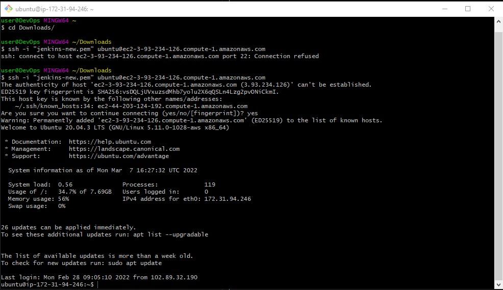
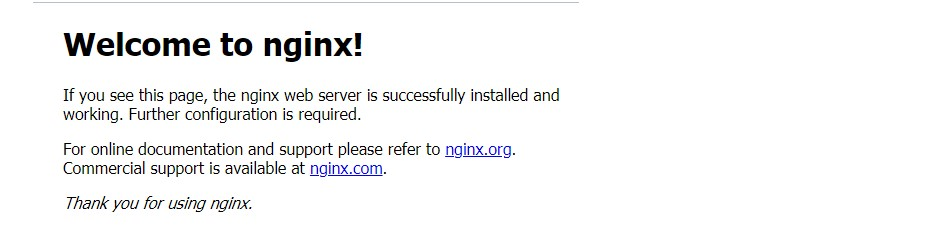
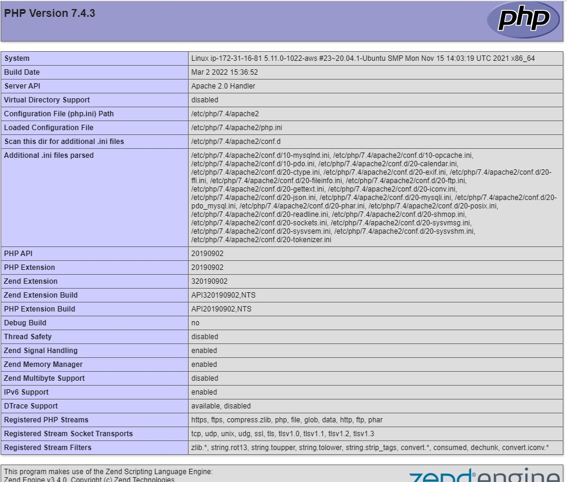
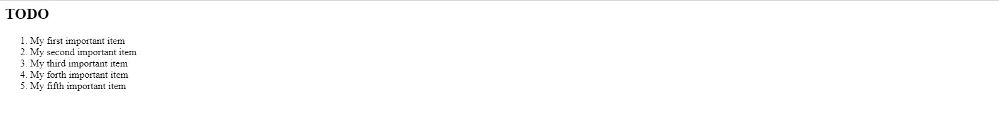

## **WEB STACK IMPLEMENTATION (LEMP STACK)** ##

### **Step 0 – Preparing prerequisites** ###

Spine a new EC2 Ubuntu 20.04 instance like was one in Project 1

Connect to the EC2 instance with the ssh-key from AWS

Use any  terminal emulator you are comfortable with

Login to your EC2 instance, you will have an interface like this:




### **STEP 1 – INSTALLING THE NGINX WEB SERVER** ###

Run these commands, to update the OS
```
sudo apt update
```
and install nginx
```
sudo apt install nginx -y
```

To verify that nginx was successfully installed and is running as a service in Ubuntu, run:
```
sudo systemctl status nginx
```

Retrieve your Public IP address, rather than check it in AWS Web console with: 
```
curl -s http://169.254.169.254/latest/meta-data/public-ipv4
```
You will see the page below in your browser if everything has gone well




### **STEP 2 — INSTALLING MYSQL** ###

Install MYSQL with the command below
```
sudo apt install mysql-server -y
```

Secure the database with the script below. Provide appropriate responses
```
sudo mysql_secure_installation
```

Test if you are able to login with
```
sudo mysql
```
Exit mysql with
```
mysql> exit
```

### **STEP 3 – INSTALLING PHP** ###

You have Nginx installed to serve your content and MySQL installed to store and manage your data. Now you can install PHP to process code and generate dynamic content for the web server.

You’ll need to install *php-fpm*, which stands for “PHP fastCGI process manager”, and tell Nginx to pass PHP requests to this software for processing. Additionally, you’ll need *php-mysql*, a PHP module that allows PHP to communicate with MySQL-based databases. Core PHP packages will automatically be installed as dependencies.
```
sudo apt install php-fpm php-mysql
```

### **STEP 4 — CONFIGURING NGINX TO USE PHP PROCESSOR** ###

When using the Nginx web server, we can create server blocks (similar to virtual hosts in Apache) to encapsulate configuration details and host more than one domain on a single server. In this guide, we will use **projectLEMP** as an example domain name.

On Ubuntu 20.04, Nginx has one server block enabled by default and is configured to serve documents out of a directory at /var/www/html. While this works well for a single site, it can become difficult to manage if you are hosting multiple sites. Instead of modifying /var/www/html, we’ll create a directory structure within /var/www for the your_domain website, leaving /var/www/html in place as the default directory to be served if a client request does not match any other sites.

Create the root web directory for **projectLEMP** as follows
```
sudo mkdir /var/www/projectLEMP
```

Change the owner to the current user
```
sudo chown -R $USER:$USER /var/www/projectLEMP
```
Then, open a new configuration file in Nginx’s sites-available directory using your preferred command-line editor. Here, we’ll use nano:
```
sudo nano /etc/nginx/sites-available/projectLEMP
```

Copy and paste the code below into the empty file created above
```
#/etc/nginx/sites-available/projectLEMP

server {
    listen 80;
    server_name projectLEMP www.projectLEMP;
    root /var/www/projectLEMP;

    index index.html index.htm index.php;

    location / {
        try_files $uri $uri/ =404;
    }

    location ~ \.php$ {
        include snippets/fastcgi-php.conf;
        fastcgi_pass unix:/var/run/php/php7.4-fpm.sock;
     }

    location ~ /\.ht {
        deny all;
    }

}
```
Here is what the code above mean


##### *listen* — Defines what port Nginx will listen on. In this case, it will listen on port 80, the default port for HTTP.

##### *root* — Defines the document root where the files served by this website are stored.

##### *index* — Defines in which order Nginx will prioritize index files for this website. It is a common practice to list index.html files with a higher precedence than index.php files to allow for quickly setting up a maintenance landing page in PHP applications. You can adjust these settings to better suit your application needs.

##### *server_name* — Defines which domain names and/or IP addresses this server block should respond for. Point this directive to your server’s domain name or public IP address.

##### *location /* — The first location block includes a try_files directive, which checks for the existence of files or directories matching a URI request. If Nginx cannot find the appropriate resource, it will return a 404 error.

##### *location ~ \.php$* — This location block handles the actual PHP processing by pointing Nginx to the fastcgi-php.conf configuration file and the php7.4-fpm.sock file, which declares what socket is associated with php-fpm.

##### *location ~ /\.ht* — The last location block deals with .htaccess files, which Nginx does not process. By adding the deny all directive, if any .htaccess files happen to find their way into the document root ,they will not be served to visitors. #####


Save the file, activate your configuration by linking to the config file from Nginx’s sites-enabled directory:
```
sudo ln -s /etc/nginx/sites-available/projectLEMP /etc/nginx/sites-enabled/
```

This will tell Nginx to use the configuration next time it is reloaded. You can test your configuration for syntax errors by typing:
```
sudo nginx -t
```
You shall see following message:
```
nginx: the configuration file /etc/nginx/nginx.conf syntax is ok
nginx: configuration file /etc/nginx/nginx.conf test is successful
```

We need to disable default Nginx host that is currently configured to listen on port 80, for this run:
```
sudo unlink /etc/nginx/sites-enabled/default
```
Reload Nginx to apply the changes:
```
sudo systemctl reload nginx
```

Create an index.html file in that location so that we can test that your new server block works as expected:
```
sudo echo 'Hello LEMP stack installation from hostname' $(curl -s http://169.254.169.254/latest/meta-data/public-hostname) 'with public IP' $(curl -s http://169.254.169.254/latest/meta-data/public-ipv4) > /var/www/projectLEMP/index.html
```

Visit 

```
http://<Public-IP-Address>:80
or
http://<Public-DNS-Name>:80
```
To check out the new page


### **STEP 5 – TESTING PHP WITH NGINX** ###

We can test it to validate that Nginx can correctly handle *.php* files off to your PHP processor.

We can do this by creating a test PHP file in your document root. Open a new file called info.php within your document root in your text editor:
```
sudo nano /var/www/projectLEMP/info.php
```
Type the following lines into the new file. This is valid PHP code that will return information about your server:
```
<?php
phpinfo();
```

We can now access this page in your web browser by visiting the domain name or public IP address you’ve set up in your Nginx configuration file, followed by /info.php:
```
http://`server_domain_or_IP`/info.php
```

We will have the page below if everything goes well




After checking the relevant information about your PHP server through that page, it’s best to remove the file you created as it contains sensitive information about your PHP environment and your Ubuntu server. You can use rm to remove that file:
```
sudo rm /var/www/your_domain/info.php
```
You can always regenerate this file if you need it later.


### **STEP 6 – RETRIEVING DATA FROM MYSQL DATABASE WITH PHP** ###

Let us create a test database (DB) with simple *"To do list"* and configure access to it, so the Nginx website would be able to query data from the DB and display it.
We will create a database named **example_database** and a user named **example_user**,
connect to the MySQL console using the root account:
```
sudo mysql
```
Create a new database:
```
mysql> CREATE DATABASE `example_database`;
```

creates a new user named example_user, using mysql_native_password as default authentication method. We’re defining this user’s password as password, but you should replace this value with a secure password of your own choosing.
```
mysql>  CREATE USER 'example_user'@'%' IDENTIFIED WITH mysql_native_password BY 'password';
```

Now we need to give this user permission over the example_database database:
```
mysql> GRANT ALL ON example_database.* TO 'example_user'@'%';
```

This will give the **example_user*** user full privileges over the **example_database** database, while preventing this user from creating or modifying other databases on your server.

Now exit the MySQL shell with:
```
mysql> exit
```

You can test if the new user has the proper permissions by logging in to the MySQL console again, this time using the custom user credentials:
```
mysql -u example_user -p
```
Notice the -p flag in this command, which will prompt you for the password used when creating the example_user user. After logging in to the MySQL console, confirm that you have access to the example_database database:
```
mysql> SHOW DATABASES;
```

This will give you the following output:
```
Output
+--------------------+
| Database           |
+--------------------+
| example_database   |
| information_schema |
+--------------------+
2 rows in set (0.000 sec)
```

Next, we’ll create a test table named todo_list. From the MySQL console, run the following statement:
```
CREATE TABLE example_database.todo_list (
mysql>     item_id INT AUTO_INCREMENT,
mysql>     content VARCHAR(255),
mysql>     PRIMARY KEY(item_id)
mysql> );
```
Insert a few rows of content in the test table. You might want to repeat the next command a few times, using different VALUES:
```
mysql> INSERT INTO example_database.todo_list (content) VALUES ("My first important item");
```
Confirm the data you input into the database
```
mysql>  SELECT * FROM example_database.todo_list;
```
Out put will be like:

```
+---------+--------------------------+
| item_id | content                  |
+---------+--------------------------+
|       1 | My first important item  |
|       2 | My second important item |
|       3 | My third important item  |
|       4 | My forth important item  |
|       5 | My fifth important item  |
+---------+--------------------------+
5 rows in set (0.01 sec)
```
Then
```
mysql> exit
```

create a PHP script that will connect to MySQL and query for your content. Create a new PHP file in your custom web root directory using your preferred editor. We’ll use vi for that:
```
sudo nano /var/www/projectLEMP/todo_list.php
```
The following PHP script connects to the MySQL database and queries for the content of the todo_list table, displays the results in a list. If there is a problem with the database connection, it will throw an exception.

Copy this content into your todo_list.php script:

```
<?php
$user = "example_user";
$password = "password";
$database = "example_database";
$table = "todo_list";

try {
  $db = new PDO("mysql:host=localhost;dbname=$database", $user, $password);
  echo "<h2>TODO</h2><ol>";
  foreach($db->query("SELECT content FROM $table") as $row) {
    echo "<li>" . $row['content'] . "</li>";
  }
  echo "</ol>";
} catch (PDOException $e) {
    print "Error!: " . $e->getMessage() . "<br/>";
    die();
}
```

Save and close the file when you are done editing.

You can now access this page in your web browser by visiting the domain name or public IP address configured for your website, followed by /todo_list.php:
```
http://<Public_domain_or_IP>/todo_list.php
```

We should see the output below from the browser.

